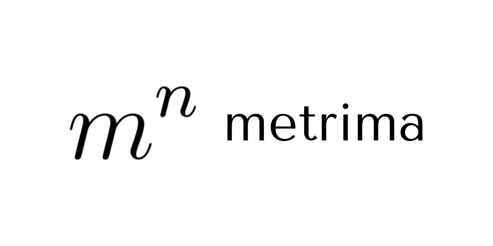

<div align="center">

**A small, comprehensive math library with fixed-point arithmetic precision and useful utilities.**

[](https://badge.fury.io/py/metrima)
[](https://www.python.org/downloads/)
[](https://opensource.org/licenses/MIT)

</div>

_Version 0.3.x **UnfinishedAlert**: The WeightUnit is unfinished and is currently inaccurate._

## Overview

Metrima is a Python math library that provides precise decimal arithmetic through the `Fx` (Fixed-point) class, eliminating floating-point precision issues. Beyond arithmetic, it includes time unit handling, functional utilities, decorators, and mathematical constants.

## Features

### Fixed-Point Arithmetic (`Fx`)

- **Precise Decimal Operations**: Avoid floating-point precision errors
- **Full Operator Support**: All standard math operations (`+`, `-`, `*`, `/`, `//`, `%`, `**`)
- **Immutable Design**: Thread-safe and predictable behavior
- **Type Conversions**: Seamless conversion between `Fx`, `int`, `float`, and `str`
- **Comparison Operations**: Complete set of comparison operators
- **Unary Operations**: Negation, absolute value, and rounding

### Time Units

- **Time Arithmetic**: Hour, Minute, Second, Millisecond classes
- **Automatic Conversions**: Seamless operations between different time units
- **Precision Handling**: Maintains millisecond precision with automatic overflow

### Utility Functions (`lib`)

- String manipulation: `trim`, `chop`, `locate`
- Collection operations: `length`, `invert`, `combinelst`, `push_back`, `attach`
- Type checking: `is_whole`, `is_whitespace`, `exists`
- Iteration utilities: `span`, `indexed`
- Deep copying: `duplicate`
- Validation: `has`, `verify`

### Decorators

- `@timed`: Measure execution time
- `@memo`: Memoization with configurable cache
- `@repeat`: Execute functions multiple times
- `@legacy`: Mark deprecated functions
- `@mimic`: Copy function metadata
- `@attribute`: Custom property-like descriptor

### Mathematical Constants

- Common constants: `PI`, `E`, `GOLDEN_RATIO`
- Physical constants: `GRAVITY`, `SPEED_OF_LIGHT`, `PLANCK_CONSTANT`
- Chemical constants: `BOLTZMANN_CONSTANT`, `AVOGADRO_NUMBER`, `GAS_CONSTANT`
- Special values: `INFINITE`, `NAN`

## Installation

```bash
pip install metrima
```

## Quick Start

### Fixed-Point Arithmetic

```python
from metrima import Fx, fx

# Create fixed-point numbers
a = Fx("1.432")
b = fx(5.1234)  # Convenience function

# Perform arithmetic
result = a + b
print(result)  # 6.5554

# Mix with regular numbers
c = Fx(10.0) - 2.45
print(c)  # 7.55

# Complex expressions
d = (Fx(2.5) + Fx(3.5)) * Fx(4) - Fx(10) / Fx(2)
print(d)  # 19.0
```

### Time Units

```python
from metrima import Hour, Minute, Second, hour, minute, second

# Create time values
duration = Hour(2) + Minute(30)
print(duration)  # 2h 30m (displayed as seconds internally)

# Arithmetic with different units
result = hour(1) - minute(15)
print(second(result))  # 2700 seconds

# Comparisons
print(Minute(60) > Hour(1))  # False
```

### Decorators

```python
from metrima import timed, memo, repeat

@timed
def slow_computation(n):
    return sum(range(n))

result, duration = slow_computation(1000000)
print(f"Computed in {duration:.3f}s")

@memo
def fibonacci(n):
    if n <= 1:
        return n
    return fibonacci(n - 1) + fibonacci(n - 2)

@repeat(increment_counter)(count=5)
def task():
    print("Running task...")
```

### Utility Functions

```python
from metrima import span, chop, trim, duplicate

# Iteration
for i in span(5):
    print(i)  # 0, 1, 2, 3, 4

# String operations
words = chop("hello,world,python", ",")
print(words)  # ['hello', 'world', 'python']

clean = trim("   hello world   ")
print(clean)  # "hello world"

# Deep copy
original = [1, [2, 3]]
copy = duplicate(original)
```

## Why Metrima?

Standard Python floating-point arithmetic can produce unexpected results:

```python
# Python's float arithmetic
0.1 + 0.2  # 0.30000000000000004 😱

# Metrima's Fx arithmetic
Fx(0.1) + Fx(0.2)  # 0.3 ✨
```

## Testing

Metrima includes comprehensive test suites covering all functionality.

### Run Interactive Tests

```bash
metrimatest
```

This launches an interactive menu with options:

1. **Competition Demo** - Compare Metrima vs Python vs Decimal
2. **Fx Class Testing** - Unit tests for fixed-point arithmetic
3. **Decorators Testing** - Test all decorator functionality
4. **Library Functions Testing** - Test utility functions
5. **TimeUnits Testing** - Test time arithmetic

### Test from Code

```python
from metrima import test_main, test_fx, test_decorators, test_lib, test_timeunits

test_main()       # Run competition tests
test_fx()         # Test Fx class
test_decorators() # Test decorators
test_lib()        # Test library functions
test_timeunits()  # Test time units
```

## API Reference

### Core Functions

```python
from metrima import add, subtract, mul, div, sigma

add(a, b)       # Addition
subtract(a, b)  # Subtraction
mul(a, b)       # Multiplication
div(a, b)       # Division
sigma(lst)      # Sum of list elements
```

### Fx Class Methods

**Arithmetic**: `__add__`, `__sub__`, `__mul__`, `__truediv__`, `__floordiv__`, `__mod__`, `__pow__`

**Unary**: `__neg__`, `__pos__`, `__abs__`, `__round__`

**Comparisons**: `__eq__`, `__ne__`, `__lt__`, `__le__`, `__gt__`, `__ge__`

**Conversions**: `__int__`, `__float__`, `__str__`, `__repr__`, `__bool__`

**Utility**: `is_zero()`, `is_positive()`, `is_negative()`, `is_integer()`, `copy()`

### Time Unit Classes

**Classes**: `Hour`, `Minute`, `Second`, `Millisecond`

**Converters**: `hour()`, `minute()`, `second()`, `ms()`

All time units support arithmetic operations, comparisons, and automatic conversions.

## Requirements

- Python >= 3.14
- `tinycolors` >= 0.5.1.3 (for colorized output)

## Version

Current version: **0.3.0**

## License

MIT License - see [LICENSE](LICENSE) file for details.

## Contributing

Contributions are welcome! Please feel free to submit a Pull Request.

## Repository

GitHub: [https://github.com/tyydev1/metrima](https://github.com/tyydev1/metrima)

## Authors

- **Razka Rizaldi** - [@razkarizaldi](mailto:razka.rizaldis@gmail.com)
- **tyydev1** - [@tyydev1](mailto:torchist@proton.me)
